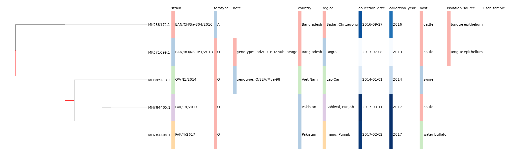

=================================================
Standalone HTML Interactive Phylogenetic Tree Viz
=================================================

.. image:: https://img.shields.io/pypi/v/shiptv.svg
        :target: https://pypi.python.org/pypi/shiptv

.. image:: https://github.com/peterk87/shiptv/workflows/CI/badge.svg
        :target: https://github.com/peterk87/shiptv/actions?query=workflow%3ACI

.. image:: https://readthedocs.org/projects/shiptv/badge/?version=latest
        :target: https://shiptv.readthedocs.io/en/latest/?badge=latest
        :alt: Documentation Status

Generate a standalone HTML file with an interactive phylogenetic tree using PhyloCanvas_

* Free software: Apache Software License 2.0
* Documentation: https://shiptv.readthedocs.io.

*See test shiptv HTML output here:*

- `fmdv-5-shiptv.html`_

**Phylogenetic tree of 5 FMDV genomes**

**Phylogenetic tree of IAV HA gene sequences**

.. image:: docs/images/iav-ha-gene-tree-scrn.png
        :alt: Phylogenetic tree of IAV HA gene sequences

Features
--------

* Interactively view your tree in the browser with metadata highlighted beside your tree using PhyloCanvas.
* Visualize your own metadata! Provide a tab-delimited table as input with ``--metadata your-metadata-table.tsv``
* Select metadata fields to display beside phylogenetic tree with select box
* Automatically retrieve metadata from a GenBank file!
* Highlight branches with low support in the browser.
* Collapse branches with low support (e.g. ``-C 95`` for IQ-TREE trees with UFBoot ``-bb 1000`` to collapse branches with less than 95% support).
* Toggle full window mode with ``shift+ctrl+f``. Works well with F11 fullscreen mode.

Usage
-----

Show help info:

.. code-block::

    $ shiptv --help

Install shiptv completions for current shell:

.. code-block::

    $ shiptv --install-completion

Most basic usage would be to create a tree from a Newick format tree file:

.. code-block::

    $ shiptv -n newick.treefile -o shiptv-tree.html

More advanced usage would be to provide a tab-delimited table of metadata with the first field containing sample names identical to those in the Newick tree file:

.. code-block::

    $ shiptv -n newick.treefile --metadata my-metadata.tsv -o shiptv-tree.html

With a reference sequence Genbank file `ref.gb`, a Newick format phylogenetic tree `tree.nwk`, output a `tree.html` standalone HTML interactive phylogenetic tree visualization and a `metadata-table.tsv` tab-delimited table of metadata from `ref.gb`.

.. code-block:: bash

    shiptv -r ref.gb -n tree.nwk -o tree.html -m metadata-table.tsv

Help output

.. code-block::

    $ shiptv --help
    Usage: shiptv [OPTIONS]

      Create HTML tree visualization with metadata.

      The metadata for reference genomes can be extracted from the specified
      Genbank file.

      Any leaf names that are present in the tree but not present in the Genbank
      file are assumed to be user samples and are flagged as such in the
      metadata table as "user_sample"="Yes".

    Options:
      -n, --newick PATH               Phylogenetic tree Newick file  [required]
      -o, --output-html PATH          Output HTML tree path  [required]
      -N, --output-newick PATH        Output Newick file
      -r, --ref-genomes-genbank PATH  Reference genome sequences Genbank file
      -m, --output-metadata-table PATH
                                      Output metadata table path
      --leaflist PATH                 Optional leaf names to select from
                                      phylogenetic tree for pruned tree
                                      visualization. One leaf name per line.

      --genbank-metadata-fields PATH  Optional fields to extract from Genbank
                                      source metadata. One field per line.

      -M, --metadata PATH             Optional tab-delimited metadata for user
                                      samples to join with metadata derived from
                                      reference genome sequences Genbank file.
                                      Sample IDs must be in the first column.

      --metadata-fields-in-order PATH
                                      Optional list of fields in order to output
                                      in metadata table and HTML tree
                                      visualization. One field per line.

      --fix-metadata / --no-fix-metadata
                                      Try to automatically fix metadata from
                                      reference Genbank file.  [default: True]

      -C, --collapse-support FLOAT    Collapse internal branches below specified
                                      bootstrap support value (default -1 for no
                                      collapsing)  [default: -1.0]

      --highlight-user-samples / --no-highlight-user-samples
                                      Highlight user samples with metadata field
                                      in tree.  [default: False]

      --outgroup TEXT                 Tree outgroup taxa
      --midpoint-root / --no-midpoint-root
                                      Set midpoint root  [default: False]
      --verbose / --no-verbose        Verbose logs  [default: False]
      --install-completion            Install completion for the current shell.
      --show-completion               Show completion for the current shell, to
                                      copy it or customize the installation.

      --help                          Show this message and exit.

Credits
-------

This package was created with Cookiecutter_ and the `audreyr/cookiecutter-pypackage`_ project template.

.. _`fmdv-5-shiptv.html`: docs/data/fmdv-5-shiptv.html
.. _Cookiecutter: https://github.com/audreyr/cookiecutter
.. _`audreyr/cookiecutter-pypackage`: https://github.com/audreyr/cookiecutter-pypackage
.. _PhyloCanvas: http://phylocanvas.org/
